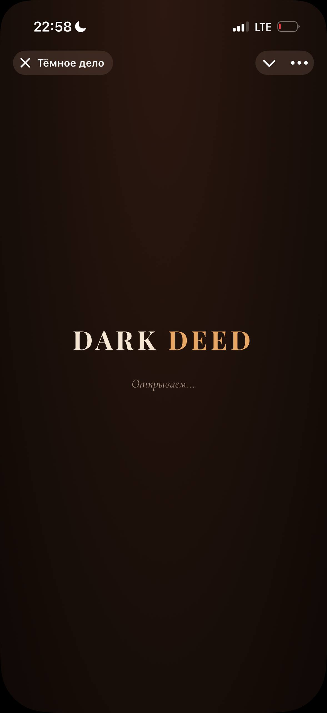
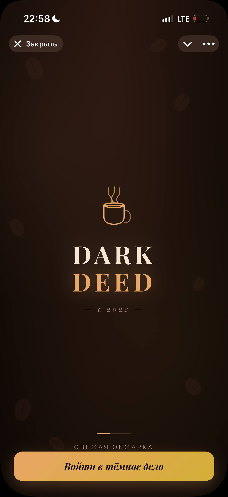
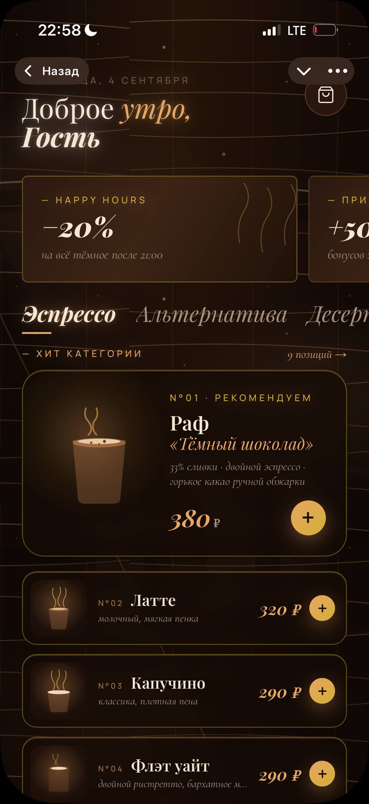
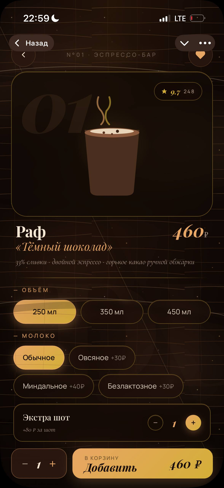
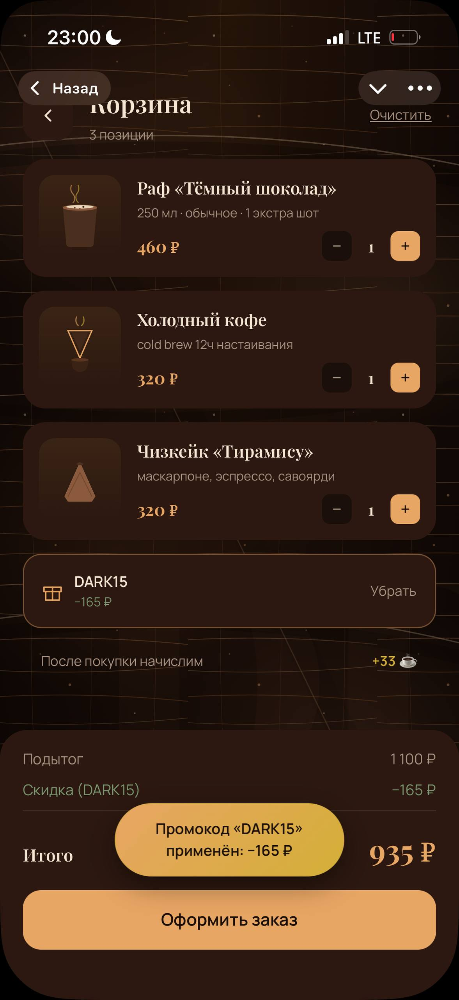
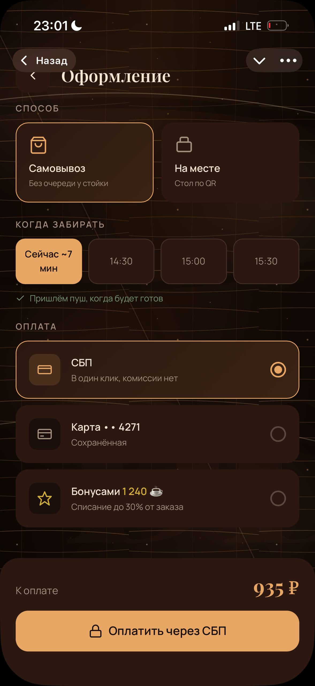
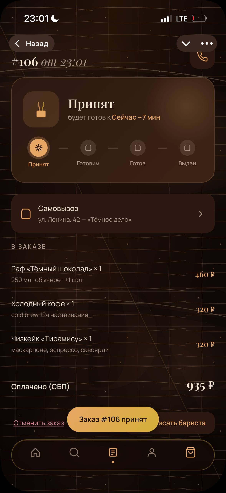

# ☕ Тёмное дело — Telegram Mini App для кофейни

Мобильное приложение внутри Telegram, через которое гости кофейни выбирают напитки, кастомизируют заказ и оплачивают одним тапом. Работает как нативная часть мессенджера — без установки, без регистрации, авторизация через Telegram.

Сделано как учебно-коммерческий проект: полноценный full-stack — фронт, БД, авторизация, серверные функции.

---

## ✨ Что умеет

- **Меню кофейни** — 14 позиций (эспрессо, альтернатива, десерты) с фильтром по категориям, поиском и подсказками
- **Карточка товара** — выбор объёма (250/350/450 мл), молока (обычное/овсяное/миндальное/безлактозное), дополнительных шотов эспрессо. Цена пересчитывается на лету
- **Корзина** — добавление, +/− количества, удаление, промокоды с валидацией через БД
- **Оформление заказа** — способ (самовывоз / за столик по QR), время, способ оплаты (СБП / карта / бонусы), комментарий бариста
- **Real-time статус заказа** — юзер видит как заказ проходит стадии *Принят → Готовим → Готов → Выдан* без обновления страницы (Supabase Realtime)
- **История заказов** — все прошлые заказы юзера, полная детализация, кнопка «Повторить заказ» — одним тапом всё возвращается в корзину
- **Избранное** — сердечко на карточке товара сохраняет в отдельный список
- **Профиль** — аватар и имя из Telegram, tier-система (Гость → Bronze → Silver → Gold) по количеству заказов, баланс бонусов, любимая категория, статистика трат
- **Промокоды** — реальная валидация из БД (тестовые `DARK15` = −15%, `WELCOME50` = −50 ₽)
- **Бонусная программа** — 3.5% от суммы заказа начисляется на счёт, копится
- **Нативные Telegram-фичи** — BackButton, HapticFeedback, автоподгонка под тёмную/светлую тему клиента, безопасные зоны (Dynamic Island, notch)

---

## 🛠 Стек

**Frontend:**
- **Next.js 16** (App Router) + **React 19** + **TypeScript**
- **Tailwind CSS v4** — стилизация
- **Zustand** + `persist/localStorage` — клиентское состояние (корзина, избранное)
- **TanStack Query** — кэш серверных данных, real-time refetch
- **@twa-dev/sdk** — Telegram Web App SDK

**Backend:**
- **Supabase Postgres 17** — база данных (RLS-политики: каждый юзер видит только свои заказы)
- **Supabase Auth** — авторизация через кастомную JWT-сессию от Telegram initData
- **Supabase Edge Functions** (Deno) — серверная логика:
  - `tg-auth` — HMAC-SHA256 проверка подписи Telegram, выдача Supabase JWT
  - `notify-order` — Bot API push-уведомления юзеру и бариста
- **pg_net** — асинхронный HTTP из Postgres-триггеров

**Инфраструктура:**
- **Vercel** — хостинг фронта, автодеплой из `main` при каждом push
- **GitHub** — репозиторий, история версий, теги-чекпойнты для отката

---

## 🚀 Как запустить локально

### Требования
- **Node.js 20+** ([скачать](https://nodejs.org/))
- Аккаунт **Supabase** ([регистрация](https://supabase.com/dashboard))
- Аккаунт **Telegram** и созданный бот через [@BotFather](https://t.me/BotFather)

### Шаги

```bash
# 1. Клонировать репозиторий
git clone https://github.com/snajdenov707-lang/dark-deed.git
cd dark-deed

# 2. Установить зависимости
npm install

# 3. Скопировать переменные окружения
cp .env.example .env.local
# ↳ открой .env.local и заполни своими значениями:
#   - TELEGRAM_BOT_TOKEN (у @BotFather после /newbot)
#   - NEXT_PUBLIC_SUPABASE_URL и NEXT_PUBLIC_SUPABASE_PUBLISHABLE_KEY
#     (Supabase Dashboard → Settings → API)

# 4. Применить миграции БД
#    (SQL-скрипты в supabase/migrations/, либо через MCP)
#    Создаст таблицы menu_items, orders, order_items, promo_codes,
#    app_settings + RLS-политики + сид с 14 позициями меню

# 5. Задеплоить edge functions (нужен Supabase CLI)
supabase functions deploy tg-auth
supabase functions deploy notify-order
# И добавь секрет: Supabase Dashboard → Functions → tg-auth → Secrets → TELEGRAM_BOT_TOKEN

# 6. Запустить дев-сервер
npm run dev
# Открой http://localhost:3000
# Для теста вне Telegram — открой http://localhost:3000/?dev=1
# (флаг ?dev=1 пропускает Telegram-авторизацию)
```

### Подключение к боту в Telegram

После деплоя на Vercel:
1. Открой [@BotFather](https://t.me/BotFather)
2. `/mybots` → выбери своего бота → **Bot Settings** → **Menu Button** → **Configure menu button**
3. Вставь URL вида `https://your-project.vercel.app`
4. Текст кнопки: `Открыть меню`
5. Открой чат с ботом → внизу появится синяя кнопка «Открыть меню» → тап

---

## 📂 Структура проекта

```
dark-deed/
├── app/                       # Next.js App Router — страницы
│   ├── page.tsx               # Splash-экран
│   ├── layout.tsx             # Корневой layout + провайдеры
│   ├── globals.css            # Токены дизайна и утилиты
│   ├── main/                  # Главная — меню, промо, категории
│   ├── product/[id]/          # Карточка товара + кастомизация
│   ├── cart/                  # Корзина + промокоды
│   ├── checkout/              # Оформление заказа
│   ├── order-status/          # Активный заказ + real-time статус
│   ├── orders/                # История заказов
│   ├── orders/[id]/           # Детали заказа + «Повторить»
│   ├── favorites/             # Избранное
│   ├── search/                # Поиск по меню
│   └── profile/               # Профиль + tier + статистика
│
├── components/
│   ├── TelegramBoot.tsx       # Auth: initData → tg-auth → Supabase session
│   ├── BottomNav.tsx          # Плавающая нижняя навигация
│   ├── KraftBackground.tsx    # Крафт-фон (SVG-волокна)
│   ├── ItemIcon.tsx           # SVG-иллюстрации 11 вариантов чашек/десертов
│   └── Toast.tsx              # Уведомления
│
├── lib/
│   ├── supabase-browser.ts    # Singleton Supabase-клиента
│   ├── api.ts                 # React Query хуки: useMenu, useCreateOrder, useUserStats и т.д.
│   ├── menu.ts                # Fallback-меню, если БД недоступна
│   ├── haptic.ts              # Обёртка над TG HapticFeedback
│   └── types.ts               # TypeScript-типы предметной области
│
├── stores/
│   ├── cart-store.ts          # Zustand + localStorage-корзина
│   └── favorites-store.ts     # Zustand-избранное
│
├── providers/
│   └── QueryProvider.tsx      # TanStack Query провайдер
│
├── .env.example               # Шаблон переменных окружения
├── next.config.ts             # Cache-Control: no-store для Telegram WebView
├── vercel.json                # Настройки деплоя Vercel
└── package.json               # Зависимости и скрипты npm
```

---

## 🖼 Скриншоты

<table>
  <tr>
    <td align="center"><br/><sub>Загрузка</sub></td>
    <td align="center"><br/><sub>Splash</sub></td>
    <td align="center"><br/><sub>Меню и промо</sub></td>
    <td align="center"><br/><sub>Карточка товара</sub></td>
  </tr>
  <tr>
    <td align="center"><br/><sub>Корзина + промокод</sub></td>
    <td align="center"><br/><sub>Оформление</sub></td>
    <td align="center" colspan="2"><br/><sub>Статус заказа</sub></td>
  </tr>
</table>

---

## 📌 Особенности реализации

- **Безопасность:** Telegram bot-токен никогда не попадает на клиент — HMAC-проверка `initData` происходит только в Supabase Edge Function
- **RLS (Row Level Security):** политики в Postgres гарантируют, что юзер физически не может прочитать чужие заказы, даже подделав запрос
- **Real-time:** статус заказа обновляется через Supabase Realtime (WebSocket) — без ручного refresh
- **CI/CD:** каждый `git push` в `main` запускает автосборку и деплой на Vercel (~30 секунд)
- **Отключение свайпа** и `overflow-x: hidden` — типовая беда Telegram WebView, требует явных фиксов в CSS
- **`env(safe-area-inset-*)`** — учёт Dynamic Island / notch на iPhone, чтобы контент не залезал под системный бар

---

## 👤 Автор

**Найденов Станислав** — студент Университета «Синергия», 3 курс

Telegram: [@_ (@khrustiks42)](https://t.me/)
Email: snajdenov707@gmail.com

---

## 📄 Лицензия

MIT — см. [LICENSE](./LICENSE)
